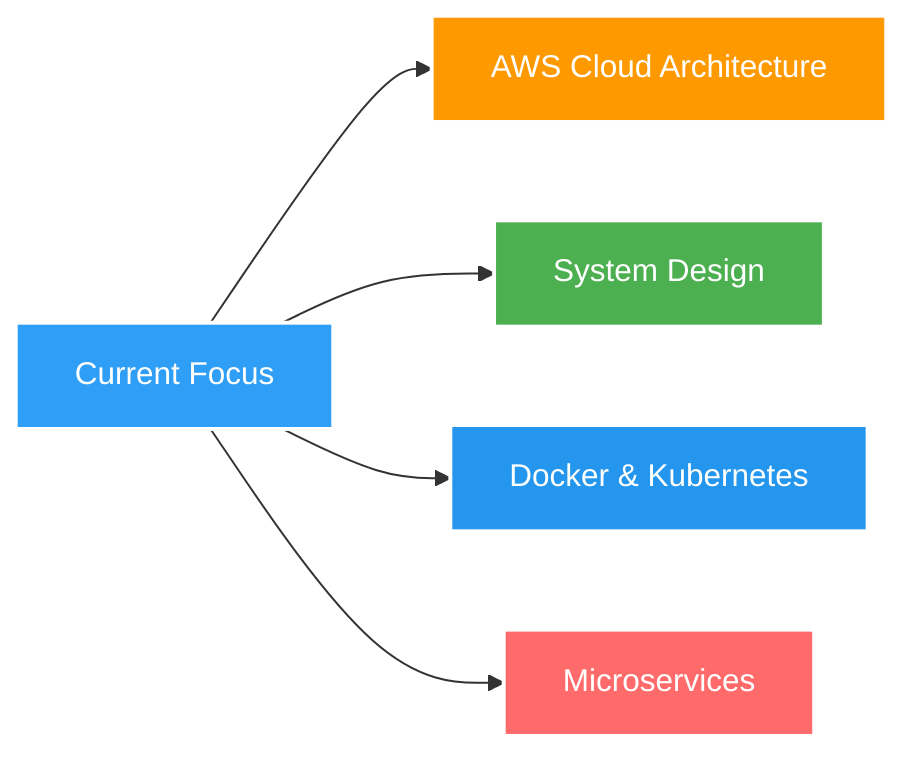

<!-- ===================== ANIMATED HEADER ===================== -->

<div align="center">
  
  <!-- Replace with your own coding/tech GIF banner -->
  <!-- Recommended: Coding animation, tech abstract, or custom banner -->
  <!-- Sources: https://tenor.com, https://giphy.com, or create custom at canva.com -->
  
  
</div>

<h1 align="center">
  
</h1>

<p align="center">
  
</p>

<p align="center">
  <a href="https://www.linkedin.com/in/gautamphere">
    
  </a>
  <a href="mailto:gautambusiness777@gmail.com">
    
  </a>
  <a href="https://github.com/gautamprabhu24">
    
  </a>
  <!-- Optional: Add your portfolio website -->
  <!-- <a href="https://yourportfolio.com">
    
  </a> -->
</p>

<div align="center">
  
  <!-- Replace this with a GIF showing: coding, thinking developer, or tech animation -->
  <!-- Recommended size: 400-500px width, professional/tech-themed -->
  <!-- Good sources: https://giphy.com/search/coding or https://tenor.com/search/developer -->
  
  
</div>

---

## 🚀 About Me

```javascript
const gautam = {
    location: "Udupi, Karnataka, India ",
    education: "B.Tech in Computer Science @ MIT Manipal",
    currentFocus: ["Backend Systems", "Cloud Architecture", "Full-Stack Development"],
    lookingFor: "Software Engineering Internships",
    
    techStack: {
        languages: ["JavaScript", "TypeScript", "Python", "C++", "Java"],
        frontend: ["React.js", "Next.js", "Tailwind CSS"],
        backend: ["Node.js", "Express", "FastAPI"],
        databases: ["PostgreSQL", "MongoDB", "MySQL", "Firebase"],
        cloud: ["AWS (Learning)", "Docker"],
        tools: ["Git", "Postman", "VS Code", "Linux"]
    },
    
    recentAchievements: [
        " Deployed production LOR system at MIT Manipal",
        " Built multi-role ERP with inventory management",
        " Developed AI-powered resume parser with NLP",
        " Created real estate platform with real-time chat"
    ],
    
    funFact: "I love working close to the system — designing APIs and building scalable backends! 🔧"
};
```

<div align="center">
  
  ### 💡 *"Building clean, secure, and scalable applications — one commit at a time"*
  
</div>

---

## 🛠️ Tech Stack & Tools

<details open>
<summary><b>🔥 Click to expand</b></summary>
<br>

### 💻 Programming Languages
<p>
  
</p>

### 🎨 Frontend Development
<p>
  
</p>

### ⚙️ Backend Development
<p>
  
</p>

### 🗄️ Databases & Storage
<p>
  
</p>

### ☁️ Cloud & DevOps
<p>
  
</p>

### 🔧 Tools & Platforms
<p>
  
</p>

</details>

---

## 💼 Professional Experience

<table>
<tr>
<td width="50%">

### 🏢 GoPerch
**Development Intern**

 **Key Contributions:**
- Built RESTful APIs using **FastAPI**
- Implemented **JWT authentication** & RBAC
- Designed **PostgreSQL schemas**
- Optimized query performance
- Handled real business workflows

</td>
<td width="50%">

### 🎓 MIT Manipal
**Project Intern**

 **Key Contributions:**
- Deployed **production-grade LOR system**
- Built complete **authentication flow**
- Implemented **email automation**
- Managed **deployment pipeline**
- Delivered under tight deadlines

</td>
</tr>
</table>

---

## 🎯 Featured Projects

<!-- PROJECT 1 -->
<div align="center">
  
### 🤖 AI Resume Parser & Job Finder
  
<!-- Replace with project screenshot/demo GIF -->
<!-- Recommended: Screenshot of your app UI or demo GIF showing functionality -->
<!--  -->

</div>

**🔍 Intelligent resume parsing system with NLP-powered data extraction**

- 📄 Extracts structured data from unstructured PDFs/DOCs
- 🎯 Confidence-aware parsing with fallback workflows
- 🔐 Robust validation and error handling
- ⚡ Built for production-grade reliability

**Tech Stack:** `Python` `Flask` `spaCy` `NLP` `React` `MongoDB`

<div align="center">
  
  [](https://github.com/gautamprabhu24)
  <!-- Add live demo link if available -->
  <!-- [](YOUR_DEMO_LINK) -->
  
</div>

<br>

<!-- PROJECT 2 -->
<div align="center">
  
### 🏡 Real Estate Web Platform
  
<!-- Replace with project screenshot/demo GIF -->
<!--  -->

</div>

**🌐 Full-stack marketplace with real-time features and payment integration**

- 💬 Real-time messaging using **WebSockets**
- 💳 Integrated **Stripe payment gateway**
- 📍 Map-based property discovery
- 🔒 Secure authentication & authorization
- 📱 Responsive, modern UI/UX

**Tech Stack:** `React` `Node.js` `Express` `MongoDB` `Socket.io` `Stripe`

<div align="center">
  
  [](https://github.com/gautamprabhu24)
  
</div>

<br>

<!-- PROJECT 3 -->
<div align="center">
  
### 📝 LOR Management System
  
<!-- Replace with project screenshot/demo GIF -->
<!--  -->

</div>

**🎓 Institutional system deployed at MIT Manipal**

- 👥 Role-based access control (Alumni, Faculty, Admin)
- 📧 Automated email workflows
- 🔐 Secure document handling
- 🚀 Production deployment on university servers
- ⚡ Built under tight deadlines

**Tech Stack:** `React` `Node.js` `MongoDB` `JWT` `Nodemailer`

<div align="center">
  
  [](https://github.com/gautamprabhu24)
  
</div>

---

## 🎓 Education

<table>
<tr>
<td align="center" width="33%">

### 🎯 B.Tech
**Computer Science**  
Manipal Institute of Technology  
📅 2024 – 2027

</td>
<td align="center" width="33%">

### 💻 Diploma
**Computer Science**  
Dr. T.M.A Pai Polytechnic  
📅 2022 – 2024

</td>
<td align="center" width="33%">

### 📚 PUC
**PCMB Stream**  
Vidyodaya PU College  
📅 Udupi

</td>
</tr>
</table>

---

## 🏆 Achievements & Highlights

<div align="center">

| 🎯 Achievement | 📝 Description |
|:--------------|:---------------|
| 🚀 **Production Deployment** | Deployed LOR system serving real university workflows |
| 💼 **Industry Experience** | Worked on live business systems at GoPerch |
| 🤖 **AI/ML Projects** | Built NLP-powered resume parser with structured extraction |
| 🌐 **Full-Stack Expertise** | Developed complete end-to-end web applications |
| ☁️ **Cloud Learning** | Actively learning AWS & deployment best practices |

</div>

---

## 📈 Currently Learning

<div align="center">



</div>

---

## 🤝 Let's Connect!

<div align="center">

### 💬 Open to Opportunities

 **Currently seeking:** Software Engineering Internships  
 **Interested in:** Backend Development, Full-Stack Roles, Cloud Engineering

<br>

<a href="mailto:gautambusiness777@gmail.com">
  
</a>
<a href="https://www.linkedin.com/in/gautamphere">
  
</a>
<a href="https://github.com/gautamprabhu24">
  
</a>

<br><br>

### 📧 **gautambusiness777@gmail.com**
### 📍 **Udupi, Karnataka, India**

<br>

<!-- Replace with your own professional photo or avatar -->
<!-- Recommended: Professional headshot, coding setup photo, or custom avatar -->
<!--  -->

</div>

---

<div align="center">
  
### ⭐ If you like my work, consider giving a star to my repositories!

### 💡 *"Code is like humor. When you have to explain it, it's bad."* – Cory House

</div>

---

<div align="center">
  
  
  
</div>
